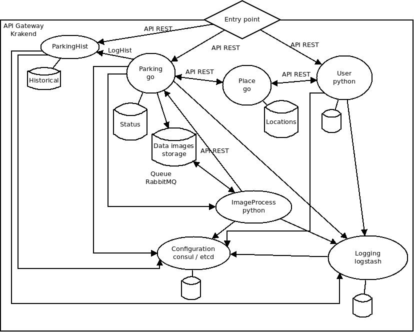

# CC-SIGA
This is a repository to design SIGA infrastructure on server side considering all parts involved in SIGA (sensors, APPS, storing, large tasks...).

SIGA (Sistema Integral de Gestión de Aparcamientos (Integral Parking Management System)) is designed for reserved parkings in public area like authorities, ambulances or, its main aim, disabled parkings. It is based on the parking lot state data is received on the system automatically when the state changes by sensors disposed on parking lot.

On the other hand, users of this type of parking have an mobile application to view and navigate to free parkings. Moreover, users can rate parking lots have been used and report if a parking lot is used without accreditation or if there is any kind of problem in any parking lot. Also, there is an application to manage parking lots, users and authorizations used by public administration and police who is informed if a parking lot is been used without authorization.

## Infrastructure overview
The infrastructure on the server side it is composed by several services to be ready to scale the system and include more functionalities if it's needed in a future. Besides, separating functionalities we get improve the security of the system.

The first approximation of the infrastructure consists of multiple services as we describe below:
 * API Gateway: as a cloud system, an API Gateway is needed to be able to change the cloud without changing applications which connect to this cloud.
 * Parking: manage all parking lots and them states. This service is called by users and sensors so it has to be as quick as possible responding all requests. When a parking is occupied this API receives the ID of the parking lot and the ID of the user, if any, and check if the user ID exists. To do that it is needed a relation between this microservice an user microservice. In addition, any change of parking lot status must be recorded in other database (ParkingHist). 
 * ParkingHist: it is the parking historical states. Every change of parking lot status must be recorded to be able to know parking lot occupancy or incidences for reporting or improve the system.
 * User: manage users and permissions. These users could be administrators or clients. Every connection to this cloud have to be authenticated. 
 * ImageProcess: if sensors get a parking lot occupied without an accreditation (user ID), they take a picture of the vehicle and this picture is been had to process to get information like a car identification. This process could be take a lot of time so data come through a queue and after the process ends, the system has to upgrade the parking status and the parking historical.
 * Configuration: this cloud system needs a configuration service to be able to make changes as quick as possible.
 * Logging: to improve all system and check possible problems of the system a logging system is needed. This service is connected to all services, as configuration, to store and process all logs.

All services have to be in a same entry point. To do that, the system needs an API gateway which handles the outside requests without have to change URLs. Depend on demand and users or sensors number, we could divide this API gateway to two APIs, one for users and the other for sensors.

To sum that, this first approximation could be like:

## Specifying the infrastructure
It is time to specify in more detail the different parts of the project. This specification deals with the choice of programming languages to be used in the different microservices, the type and engine of the databases to be used as well as the API Gateway to be used, the logging and configuration systems and the queue to be used.

### API Gateway
The API Gateway we could choose is NGINX API Gateway. NGINX is a powerful load balancer, web server and reverse proxy but, also, it has a specific solution aimed at microservices‑based applications and it has a lot of [documentation](https://www.nginx.com/blog/deploying-nginx-plus-as-an-api-gateway-part-1/) . However, this solution is not free neither open source.

Looking for a free and open source solution [Krakend](https://www.krakend.io/) could be the best option for an API Gateway and also it has a lot of [documentation](https://www.krakend.io/docs/overview/introduction/).

### Configuration system
A fundamental part of a microservices‑based application is configure all distributed microservices as easy as possible. Here we could face to a several configuration and service discovery tools. Due to this is a open project, we want all tools which compose the project open as well.

To facilitate the decision of which configuration tool is the best for this project, is better to see a [comparative](https://stackshare.io/service-discovery) where [Consul](https://www.consul.io/) could be one of the best free and open source tool. Also it has a lot of [documentation](https://www.consul.io/docs/index.html) to read. Another could be [etcd](https://etcd.io/) installed by default in cloud OS.

### Logging system
Another fundamental part of a microservices‑based application is to log all microservices errors or information in only one site. This site could be centralized or distributed but developers wont have to see logs microservice per microservice.

As the before decision, here we could see a [comparative](https://stackshare.io/log-management) where [Logstash](https://www.elastic.co/products/logstash) could be one of the best tools to centralize all logs. Moreover, we a lot of [information](https://www.elastic.co/guide/en/logstash/current/index.html) about this tool.
